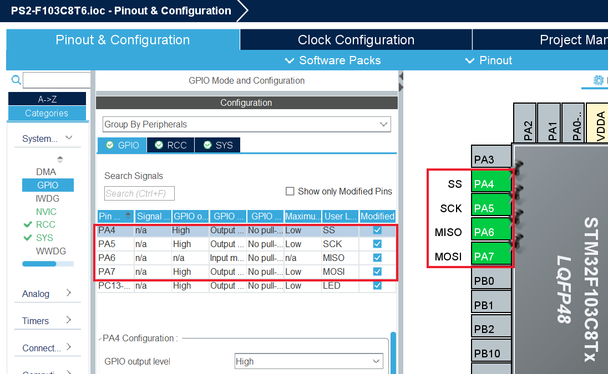
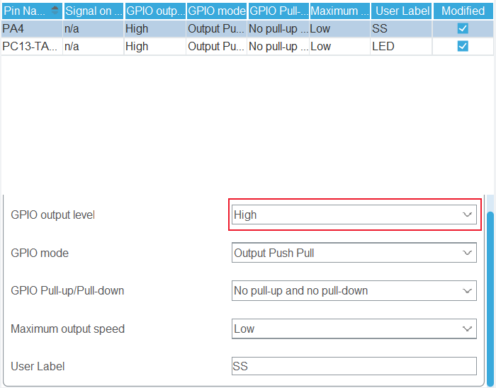
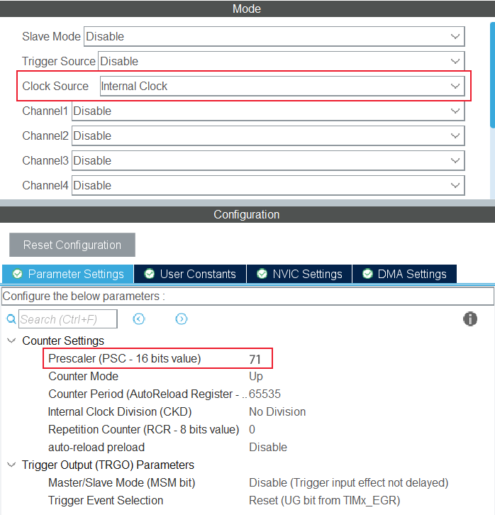
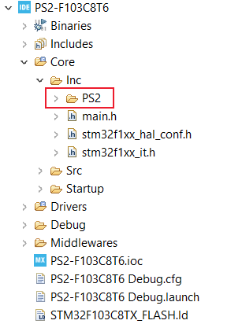

# STM32 HAL PS2 Library

This library is written for STM32 chips based on HAL libary.

## 1. Prepartions

### 1.1 CubeMX Configuration

You need to use CubeMX or CubeIDE to configurate some Hardware preparations.

#### 1.1.1 SPI Configuration

First, choose a SPI Port, you need to pay more attention to the **red** box configuration.

At the same time, make sure that you SPI baudrate is under **250KHz**. If there's something wrong with communication, you may need to lower you baudrate. Here I choose 125KHz.



And you also need to choose a SS pin for your SPI port. You can any GPIO as your SS Pin, but make sure SS Pin init status is **HIGH**.



#### 1.1.2 Timer Configuraion

Second, I use a timer to create a **delay_us** function. When you configurate timer, make sure that your timer is 1us per clock tick. For example, my system clock is **32MHz**, so my timer prescable should be **31**.



### 1.2 Library Configuration

Copy my PS2 Libary to your projects source folder `Core/Inc` like below



## 2. Use PS2 Library

After you finish configurating hardware and copying PS2 library in your project, now you can use it in your project.

First, you need to include PS2 library in your main.c file

```c
#include "PS2/PS2.h"
```

Then you need to create a PS2 Object for easy usage, you can read any button status through PS2.\<BUTTONNAME\>, like PS2.UP

```c
PS2Buttons PS2;
```

After this, you need to pass these argumemts to PS2_Init function

```c
PS2_Init(&hspi1, &htim1, &PS2, SS_GPIO_Port, SS_Pin);
```

In your loop, you  need call PS2_Update every time you want to update PS2 Buttons, and you can use these buttons to finish some jobs.

```c
while (1) {
  PS2_Update();
  if (PS2.UP) {
    HAL_GPIO_WritePin(LED_GPIO_Port, LED_Pin, GPIO_PIN_RESET);
  } else if (PS2.DOWN) {
    HAL_GPIO_WritePin(LED_GPIO_Port, LED_Pin, GPIO_PIN_SET);
  }
}
```

Below is 20 buttons you can use in PS2Buttons object, note that last four buttons are analog joystick value which varies from **0~255**, other 16 buttons are just **0** and **1**.

```c
typedef struct {
  uint8_t SELECT;
  uint8_t L3;
  uint8_t R3;
  uint8_t START;
  uint8_t UP;
  uint8_t RIGHT;
  uint8_t DOWN;
  uint8_t LEFT;
  uint8_t L2;
  uint8_t R2;
  uint8_t L1;
  uint8_t R1;
  uint8_t TRIANGLE;
  uint8_t CIRCLE;
  uint8_t CROSS;
  uint8_t SQUARE;
  uint8_t RX;
  uint8_t RY;
  uint8_t LX;
  uint8_t LY;
} PS2Buttons;
```

## 3. Reference

When I write these PS2 Library, I searched a lot of informaton. These two articals are most usful I use for write this. You can read these two articals if you want to write yourself.

[Interfacing a PS2 (PlayStation 2) Controller.](https://store.curiousinventor.com/guides/PS2)

[Playstation 2 (Dual Shock) controller protocol notes.](https://gist.github.com/scanlime/5042071)